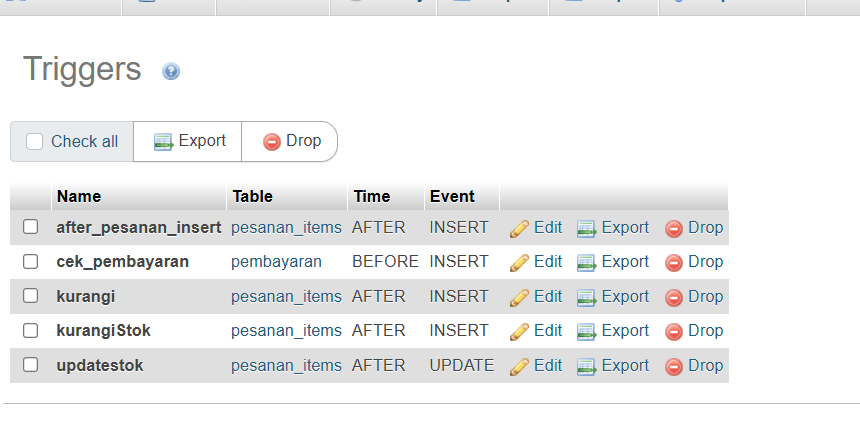

# Tugas Worksheet

## Soal 2
Buatlah Stored Procedure dengan nama kurangi_stok untuk mengurangi stok produk. Stok berkurang sesuai dengan jumlah pesanan produk.

```sql
delimiter $$
create procedure kurangi_stok(in produk_id int, in jumlah int)
begin
    update produk
    set stok = stok - jumlah
    where id = produk_id;
end $$
delimiter ;
```
### Hasil query


## Soal 3
Buatlah Trigger dengan nama trig_kurangi_stok yang akan mengurangi stok produk jika terjadi transaksi pesanan oleh pelanggan (memanggil stored procedure kurangi_stok soal no 2).

Trigger ini aktif setelah trigger after_pesanan_items_insert (trigger pada contoh 3).

```sql
delimiter $$
create trigger kurangiStok after insert on pesanan_items
for each row
begin
    call kurangi_stok(new.produk_id, new.qty);
end $$

delimiter ;
```
### Hasil query
