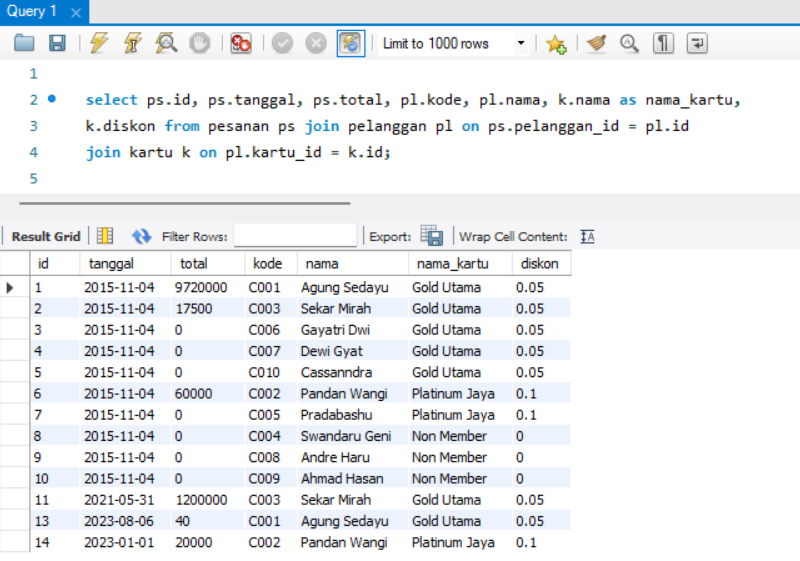
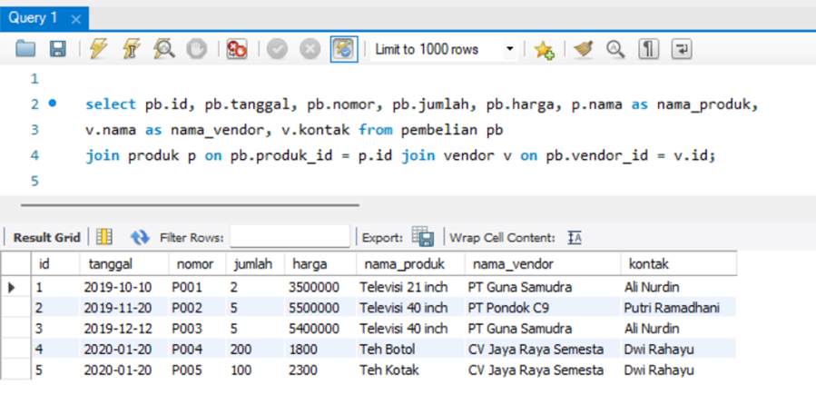
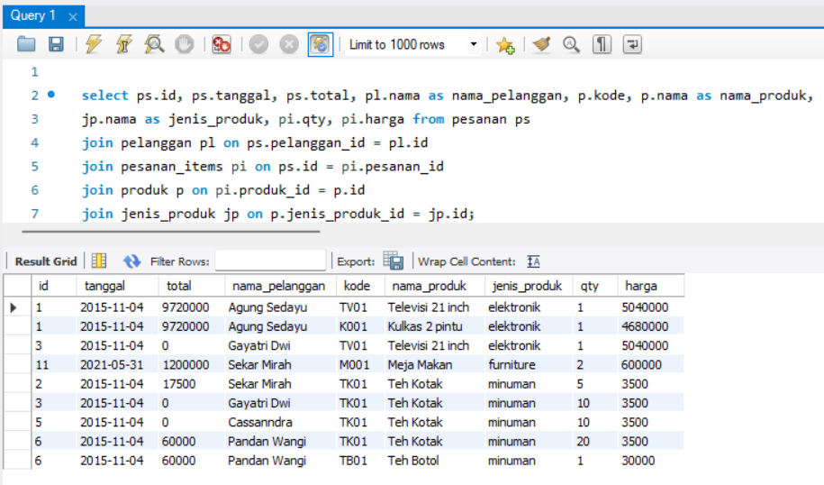
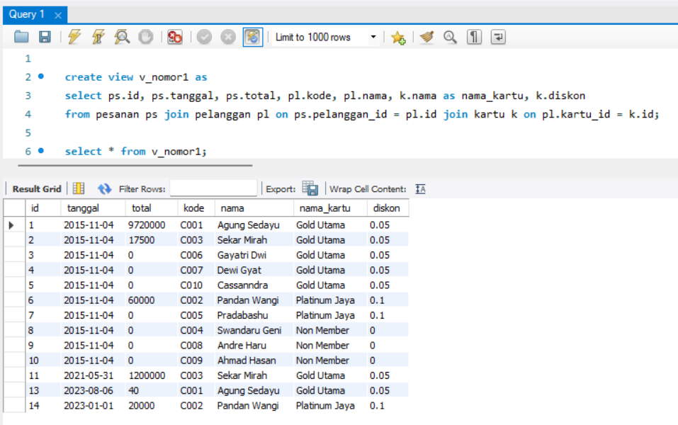
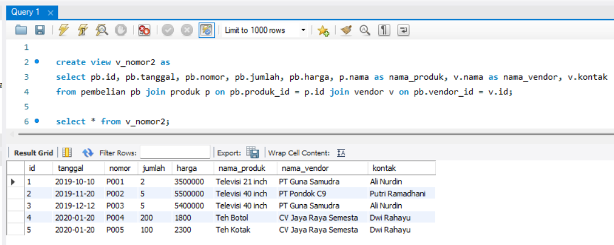
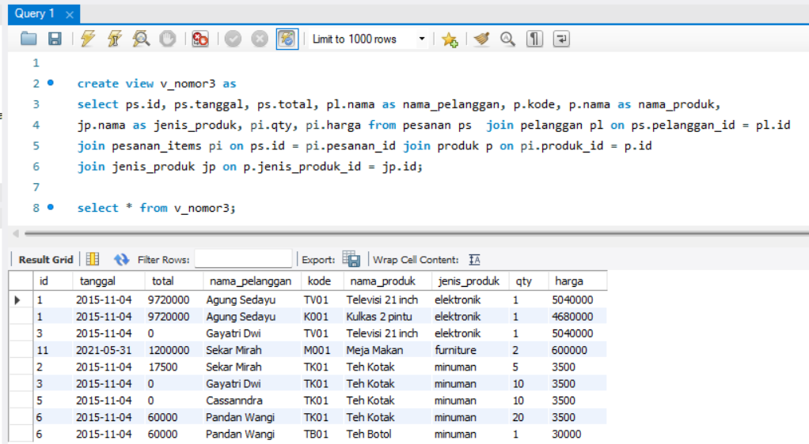

# Tugas Worksheet 4

## Soal 1
Join 3 tabel : pesanan, pelanggan, kartu

```sql
select ps.id, ps.tanggal, ps.total, pl.kode, pl.nama, k.nama as nama_kartu, k.diskon
from pesanan ps join pelanggan pl on ps.pelanggan_id = pl.id join kartu k on pl.kartu_id = k.id;
```
### Hasil query



## Soal 2
Join 3 tabel : pembelian, produk, vendor

```sql
select pb.id, pb.tanggal, pb.nomor, pb.jumlah, pb.harga, p.nama as nama_produk, v.nama as nama_vendor, v.kontak 
from pembelian pb join produk p on pb.produk_id = p.id join vendor v on pb.vendor_id = v.id;
```
### Hasil query



## Soal 3
Join 5 tabel : pesanan, pelanggan, pesanan_items, produk, jenis_produk

```sql
select ps.id, ps.tanggal, ps.total, pl.nama as nama_pelanggan, p.kode, p.nama as nama_produk,
jp.nama as jenis_produk, pi.qty, pi.harga from pesanan ps 
join pelanggan pl on ps.pelanggan_id = pl.id
join pesanan_items pi on ps.id = pi.pesanan_id
join produk p on pi.produk_id = p.id
join jenis_produk jp on p.jenis_produk_id = jp.id;
```
### Hasil query



## Tampilan View
View soal 1


View soal 2


View soal 3
