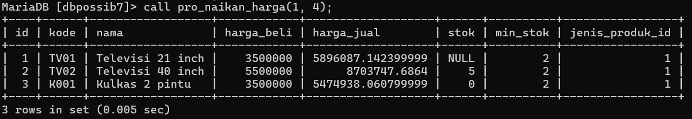
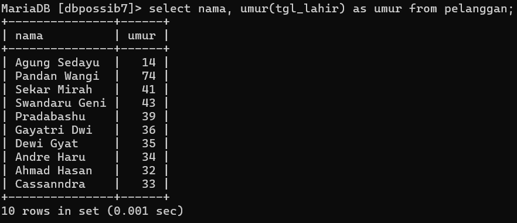
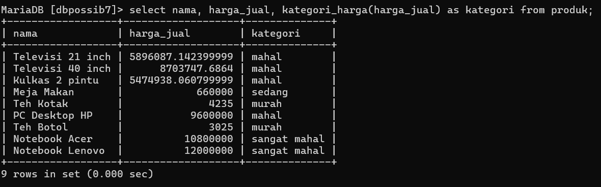
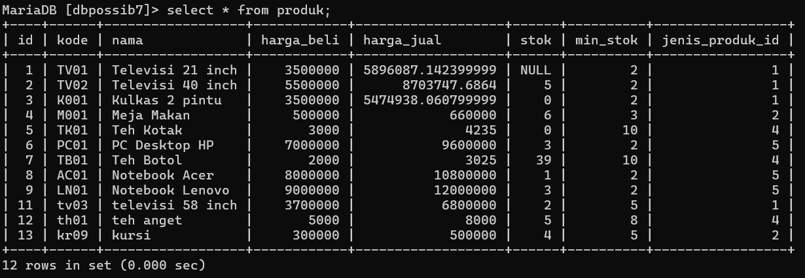
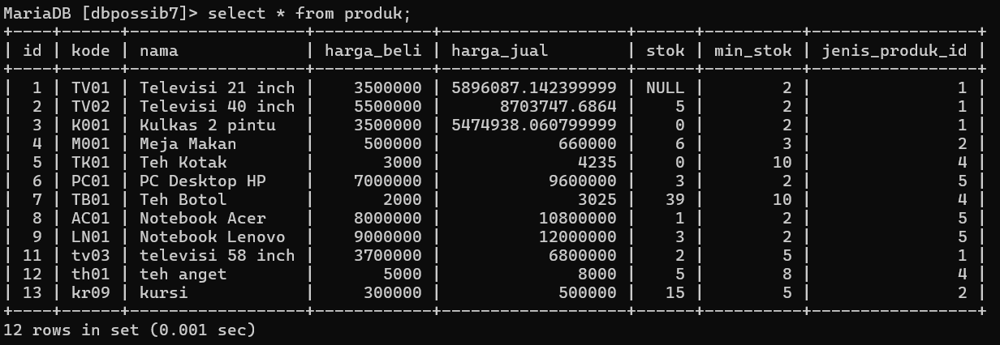
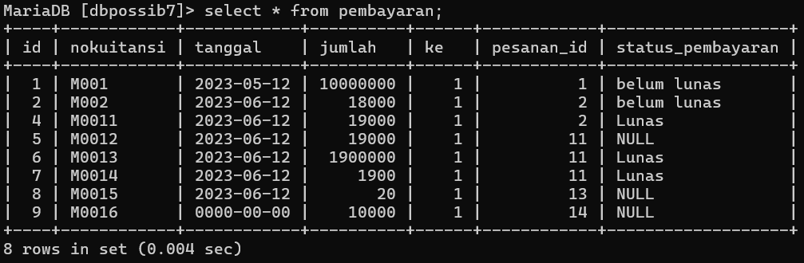
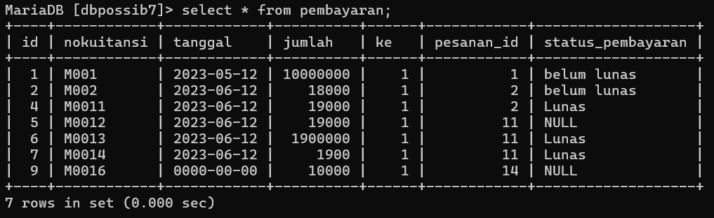
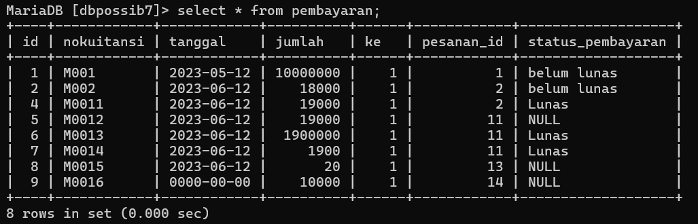
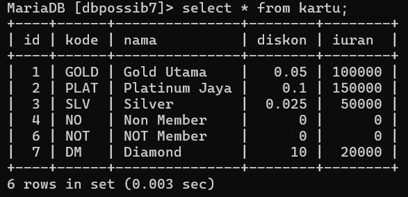
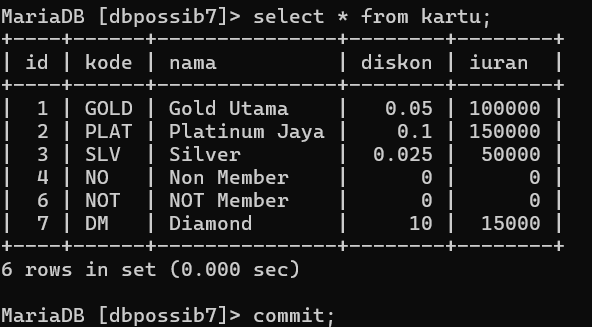

# Tugas Worksheet 5

## Tugas 5.1
## Soal 1
Buatlah Procedure untuk mengupdate harga_jual berdasarkan jenis produk tertentu (jenis_produk_id), beri nama procedure pro_naikan_harga memiliki parameter yang akan menerima argumen: Jenis Produk ID dan Persentase kenaikan harga.

```sql
delimiter $$
create procedure pro_naikan_harga(
in jenis_produk int,
in persentasi_kenaikan int )
begin
    update produk
    set harga_jual = harga_jual + (harga_jual * persentasi_kenaikan / 100)
    where jenis_produk_id = jenis_produk;
    select * from produk where jenis_produk_id = jenis_produk;
end $$
delimiter ;
```
### Hasil query



## Soal 2
Buat fungsi umur dengan parameter yang menerima inputan argumen tipe data date dan mengembalikan hasil perhitungan umur (tahun sekarang dikurang tahun inputan) dengan tipe data bilangan bulat (integer) positif.

```sql
delimiter $$
create function umur(tgl_lahir date)
returns int
deterministic
begin
    declare umur int;
    set umur = year(curdate()) - year(tgl_lahir);
    if (month(curdate()) < month(tgl_lahir)) or 
       (month(curdate()) = month(tgl_lahir) and day(curdate()) < day(tgl_lahir)) then
        set umur = umur - 1;
    end if;

    if umur < 0 then
        set umur = 0;
    end if;
    return umur;
end $$

delimiter ;
```
### Hasil query



## Soal 3
3.Buat fungsi kategori_harga dengan parameter yang menerima inputan argument tipe data double dan mengembalikan tipe data string kategori harga berdasarkan: 
- 0 – 500rb : murah
- 500rb – 3 juta : sedang
- 3jt – 10 juta : mahal 
- 10 juta > : sangat mahal

```sql
delimiter $$
create function kategori_harga(harga double)
returns varchar(20)
deterministic
begin
    declare kategori varchar(20);
        if harga <= 500000 then
            set kategori = 'murah';
        elseif harga > 500000 and harga <= 3000000 then
            set kategori = 'sedang';
        elseif harga > 3000000 and harga <= 10000000 then
            set kategori = 'mahal';
        else
            set kategori = 'sangat mahal';
        end if;
    return kategori;
end $$
delimiter ;
```
### Hasil query



## Tugas 5.2
## Soal 1
Buatlah sebuah transaction dengan skenario-skenario statement sebagai berikut:
- Mulai transaction
- Insert data produk sebanyak 3 record

```sql
start transaction;
insert into produk (kode, nama, harga_beli, harga_jual, stok, min_stok, jenis_produk_id) values
('tv03', 'televisi 58 inch', 3700000, 6800000, 2, 5, 1),
('th01', 'teh anget', 5000, 8000, 5, 8, 4),
('kr09', 'kursi', 300000, 500000, 4, 5, 2);
```



- Update data stok salah satu produk
- Buat savepoint
```sql
update produk set stok = 15 where id = 13;
savepoint update_data;
```



- Hapus salah satu data pembayaran


```sql
delete from pembayaran where id = 8;
```



- Kembali ke savepoint
```sql
rollback to update_data;
```



- Update data iuran salah satu kartu
- Akhiri transaction dengan commit


```sql
update kartu set iuran = 15000 where id = 7;
commit;
```
